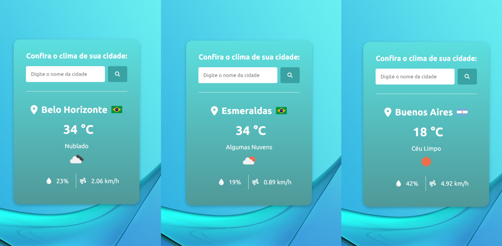

# Clima APP

Aplicação desenvolvida em Python com o intuito de exibir as informações climáticas de uma determinada cidade.

A aplicação exibe informações como a temperatura atual, o clima, a umidade relativa do ar e a velocidade média do vento, além do país no qual a cidade informada está situada.

## Tecnologias Utilizadas
- **HTML** - https://www.w3schools.com/html/
    - `Font Awesome` - https://www.w3schools.com/icons/default.asp

- **CSS** - https://www.w3schools.com/css/

- **Python** - https://www.python.org/
    - `requests` - https://pypi.org/project/requests/
    - `os` - https://docs.python.org/pt-br/3/library/os.html

- **Flask** - https://flask.palletsprojects.com/en/3.0.x/

- **OpenWeatherAPI** - https://openweathermap.org/

- **CountryFlagsAPI** - https://flagsapi.com/


### Dependências e Versões

- `blinker==1.8.2`
- `certifi==2024.8.30`
- `charset-normalizer==3.3.2`
- `click==8.1.7`
- `colorama==0.4.6`
- `Flask==3.0.3`
- `idna==3.10`
- `itsdangerous==2.2.0`
- `Jinja2==3.1.4`
- `MarkupSafe==2.1.5`
- `python-dotenv==1.0.1`
- `requests==2.32.3`
- `urllib3==2.2.3`
- `Werkzeug==3.0.4`

### Como rodar o projeto

Para rodar o projeto, siga as instruções abaixo para configurar o ambiente e instalar as dependências necessárias.

**Clone o Repositório**

Primeiro, clone o repositório para sua máquina local usando o Git. Abra um terminal e execute o comando:

```
git clone https://github.com/CarlosHPinheiro/clima-app
cd repositorio
```

**Crie um Ambiente Virtual (Recomendado)**

Esse não é um passo obrigatório mas é recomendado a criação de um ambiente virtual para gerenciar as dependências do projeto.

Para criar um ambiente virtual, execute:

```
python -m venv venv
```

**Ative o ambiente virtual**

-   Sistema Operacional Windows:

```
.\venv\Scripts\activate
```

-   Sistema Operacional MacOs e Linux:

```
source venv/bin/activate
```

**Instale as dependências**

Com o ambiente virtual ativado, instale as dependências listadas no arquivo `requirements.txt` utilizando o seguinte comando:

```
pip install -r requirements.txt
```

**API key** 

A aplicação utiliza dados climáticos coletados e fornecidos pela Open Weather através de requisições feitas à sua API.

Para obter acesso aos dados climáticos através das requisições, é necessário possuir uma chave API válida. A chave pode ser adquirida através do site oficial da Open Weather.

A aplicação utiliza variáveis de ambiente para ter acesso a chave da API utilizada nas requisições. Configure a chave válida em uma variável `API_KEY` no arquivo `.env`.

**Execução**

Após concluir os passos anteriores, para rodar o programa basta executar o arquivo `routes.py` para criar o servidor local. Por padrão a aplicação será executada em `https://localhost:5000/`

### Screenshots


